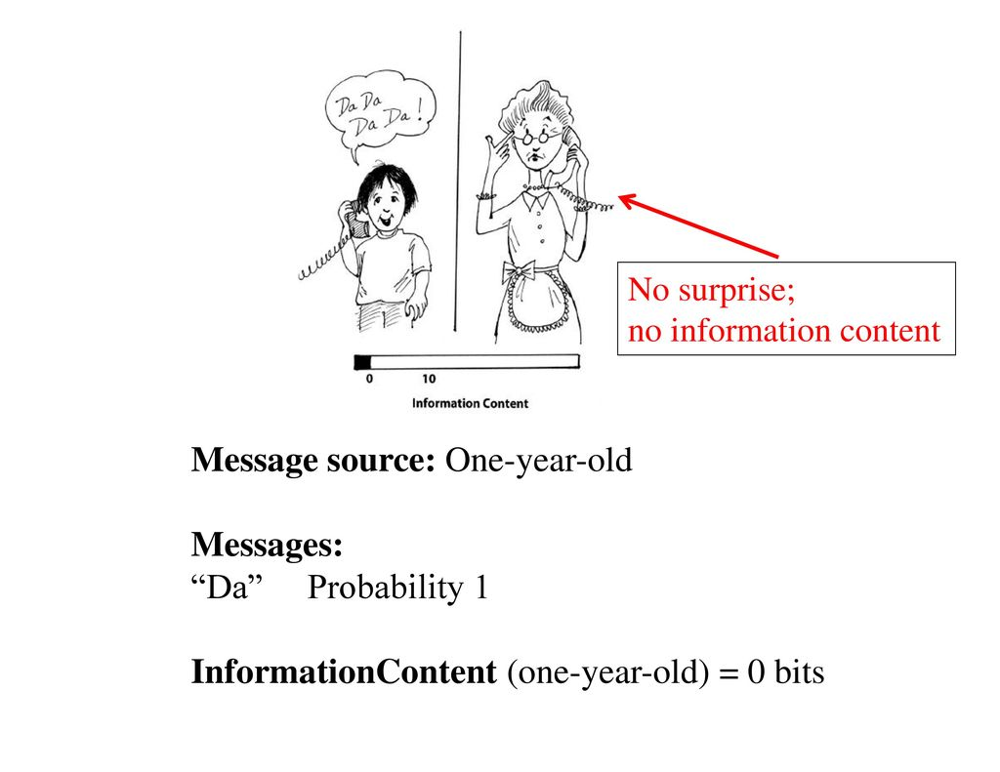
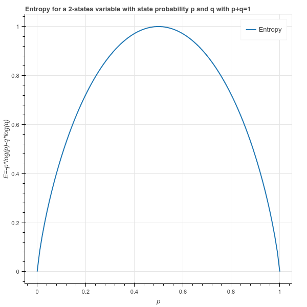
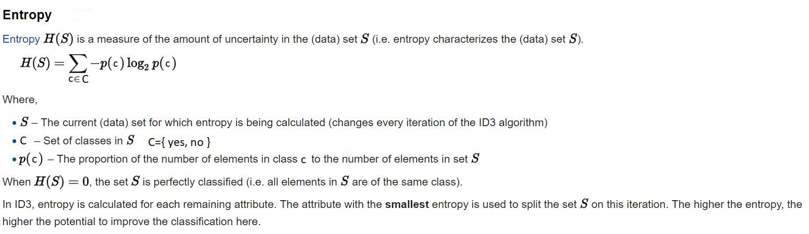
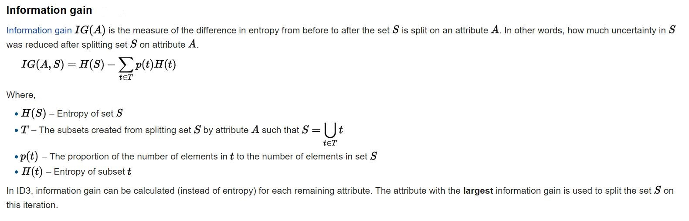
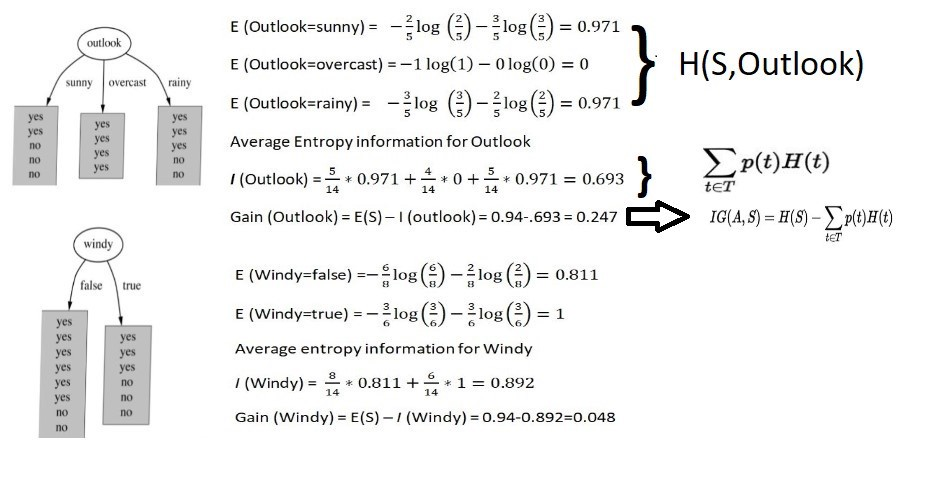
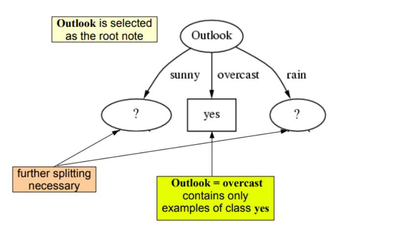
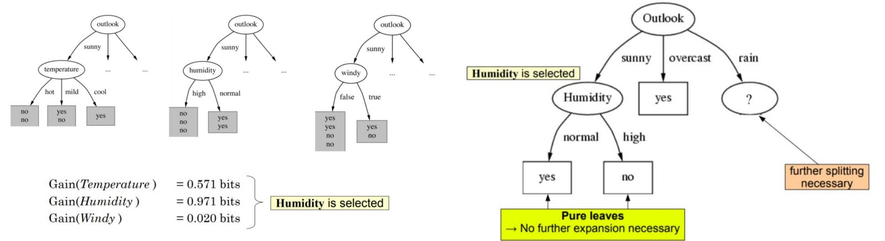
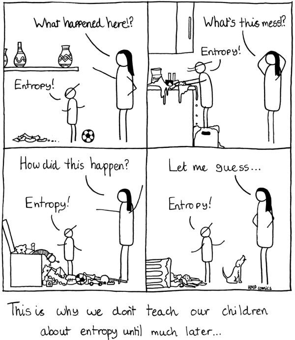

# Entropy and Information Gain 

## Introduction
Information gain as we discussed earlier is calculated using a statistical measure called the __Entropy__. Entropy is a widely used concept used in fields of Physics, mathematics, computer science (information theory) etc. You may come across the idea of entropy in thermodynamics, societal dynamics and a number of other domains. In electronics and computer sciences, the idea of entropy is usually derived from __Shannon's__ description of entropy to measure the information gain against some cost incurred in the process. In this lesson, we shall look at how this works with the simple example we introduced in previous lesson. 
## Objectives

You will be able to:

- Understand and explain Shannon's Entropy and Information Gain measures 
- Calculate Entropy and Information gain by hand for a simple dataset
- Identify the process for selecting best attribute for a split

## Shannon's Entropy

> __Entropy is a measure of Disorder or Uncertainty.__

The measure is Named after *Claude Shannon*, who is known as the "father of information theory". Information theory provides measures of the uncertainty associated with a random variables. These measures help calculate the average information content one is missing when one does not know the value of the random variable. This uncertainty is measures in bits, i.e.  the amount of information (in bits) contained per average instance of an instance in a stream of instances.

Conceptually, information can be thought of as being stored in or transmitted as variables that can take on different values. A variable can be thought of as a unit of storage that can take on, at different times, one of several different specified values, following some process for taking on those values. Informally, we get information from a variable by looking at its value, just as we get information from an email by reading its contents. In the case of the variable, the information is about the process behind the variable.

> The entropy of a variable is the "amount of information" contained in the variable. 

This amount is determined not just by the number of different values the variable can take on, just as the information in an email is quantified not just by the number of words in the email or the different possible words in the language of the email. Informally, the amount of information in an email is proportional to the amount of “surprise” its reading causes. 

For example, if an email is simply a repeat of an earlier email, then it is not informative at all. On the other hand, if say the email reveals the outcome of an election, then it is highly informative. Similarly, the information in a variable is tied to the amount of surprise that value of the variable causes when revealed.

> Shannon’s entropy quantifies the amount of information in a variable, thus providing the foundation for a theory around the notion of information.

In terms of data, we can informally describe entropy as:
> Entropy is an indicator of how messy your data is.

A high entropy always reflects "messed-up" data with low/no information content. The uncertainty about content of the data, before viewing the data remains same (or almost same) as that before the data was available. 

## Entropy and Decision Trees

> Decision trees aim to tidy the data by separating the samples and re-grouping them in the classes they belong to.

We know the target variable since we are using a supervised approach having a training set. So we maximize the **Purity** of the classes __as much as possible__ while making the splits, aiming to have a __clarity__ in the leaf nodes. Remember, it may not be possible to remove the uncertainty totally i.e. to fully clean up the data. Have a look at the image below:

We can see that the split has not __FULLY__ classified the data above, but the resulting data is __tidier__ than it was before the split. Using a series of such splits using different feature variables, we try to clean up the data as much as possible in the leaf nodes. At each step, we want to decrease the entropy, so __entropy is computed before and after the split__. If it decreases, the split is retained and we can proceed to the next step, otherwise, we must try to split with another feature or stop this branch (or quit, calling it best solution).

###  Calculating Entropy

if we have a sample containing $N$ items falling into two categories, $n$ observations having a target=1 and $m=N-n$ observations will have a target label 2. 

So what we want to do is group these observations according to the target class they belong to. We can write 
down the ratio of each class as:

$$p = n/N - (class 1)$$ $$q = m/N = 1-p - (class 2)$$

Based on this , the entropy of the complete dataset, before the split is calculated as:

$$E = -p . log_2(p) - q . log_2(q)$$

Above equation tells us that according to entropy law, a dataset is considered tidy if it only contains one class (i.e. no uncertainty or confusion). If there is a mix of classes in the target variable , the entropy (or uncertainty about data) goes high. Looking at the entropy function below, when $p=0$ , i.e. no observations for class 1, OR , if all data belongs to class 1 so that $p=1$, the entropy will become zero. It will be MAXIMUM when there is an equal mix of classes 1 and 2 observations i.e. $p=0.5$ tells us that we are equally uncertain about both classes. Think about a fair coin. Before the coin toss, your uncertainty is is at max because any side can come up. The entropy , hence, is maximum.  

When we start with a messy set with entropy 1 (p=q). In the worst case, it could be split into 2 messy sets where half of the items are labeled 1 and the other half have Label 2 in each set. Hence the entropy of each of the two resulting sets is 1. In this scenario, the uncertainty has not changed and we would have the same entropy before and after the split. We can not just sum the entropies of the two sets. A solution, often used in mathematics, is to compute the mean entropy of the two sets. 

In this case, the mean is one. However, in decision trees, a weighted sum of entropies is computed instead (weighted by the size of the two subsets):

$$Entropy_{split} = (n1/N).E1 + (n2/N).E2$$

where n1 and n2 are the number of items of each sets after the split and E1 and E2 are their respective entropy. It gives more importance to the set which is larger (if any). 
> The idea behind weighted average is that the larger class requires more efforts to tidy. 

### Generalization of Entropy 

So above we saw how to calculate entropy for a two class variable. In reality, we deal with multiclass problems very often , so it would be a good idea to see a general representation of above formula. 

## Information Gain 

> __Information gain is an impurity/uncertainty based criterion that uses the entropy as the impurity measure.__ 

Information gain is the key criterion that is used by ID3 classification tree algorithm to construct a Decision Tree. Decision Trees algorithm will always tries to __maximize Information gain__. Entropy of dataset is calculated using each attribute, and the attribute showing highest information gain is used to create the split at each node. A simple understanding of information gain can be written as:

$$Information~Gain  = Entropy_{parent} - Entropy_{child}.[child ~weighted ~average]$$

A weighted average based on number of samples in each class is multiplied to child entropy , as most datasets would have an imbalance of classes. Thus information gain calculation for each attribute is calculated and compared, and the attribute showing highest value of info gain will be selected for the split. Below is a more generalized form of the equation.

## Entropy and Information Gain Example

Right, we've seen quite a bit of maths so far, let's bring back our small dataset from previous lesson and see how can compute entropy and create splits for the tree. Quick refresher, the dataset contains historic data of weather a person plays tennis or not, given some conditions weather outlook, temperature, humidity and wind. 

Let's apply the formulas we saw earlier to this problem. 

### Step 1 : Compute Entropy for Weather Dataset

### Step 2: Calculate Entropy and Information Gain for all attributes

Let's see how the split will effect the tree shape based on two of the attributes outlook and windy. The images on the left reflect the resulting split. 

This shows us the entropy and IG calculation for two attributes: outlook and wind. We can see that outlook gives a higher information gain than windy. On the left, we can also see data becoming tidier as a result of splitting at outlook. 
__Task: Try calculating Entropy and IG for remaining two attributes__.

Let's see the what the final picture will look like:

So the outlook attribute gives highest information gain, and hence will be used for splitting at the root node. 

We can see when its overcast, we have all examples with target "yes" i.e. we always go an play tennis in this weather. Our confusion is gone, the uncertainty has come down and this leads to a leaf node (doesnt need further splitting). However, when its sunny or rainy weather, there is still uncertainty as we still have a mix of positive and negative examples (a mix of yes and no). So we need to repeat the process above and create further splits at these nodes. 

As we proceed, our tree will keep getting deeper, until all classes are separated in leaf nodes i.e. we will have leaf nodes wit only positive OR negative examples. 

For the next split, humidity gives us higher entropy value as shown above and successfully separates both classes, leading to "pure leaves". And so the process goes on until we get a tree that looks like the one below:

So choosing the windy attribute for thrird splits allows all leaf nodes to be pure. And now we can reflect this as a set of if else statements. 

- If outlook is sunny and humidity is high , then play = no
- If outlook is rainy and its windy as well, then play = no
- in all other circumstances , play = yes. 

So you see we have derived a working model for a decision tree from our simple dataset. Next we shall implement this calculation in python to get the same tree. 

## Additional Resources

The idea of entropy and information gain could be a bit mind boggling to start off with. As we briefly discussed , this has its roots in information theory , instead of frequesntist/bayesian probability OR linear algebra etc as we saw with our previous architectures. It is imperative that we have a sound understanding of how a certain classifiers performs. Do visit following resources and read more on this. 

* https://arxiv.org/pdf/1405.2061.pdf - Understanding Shannon's Entropy 
* https://medium.com/coinmonks/what-is-entropy-and-why-information-gain-is-matter-4e85d46d2f01 - Another worked example for calculating entropy and IG.

## Summary 

In this lesson, we looked at calculating Entropy and INformation Gain measures for building decision trees. We looked at a simple example and saw how to use these measures to select best split at each node. Next, we shall try to calculate the same in Python, before digging deeper into decision trees. 
